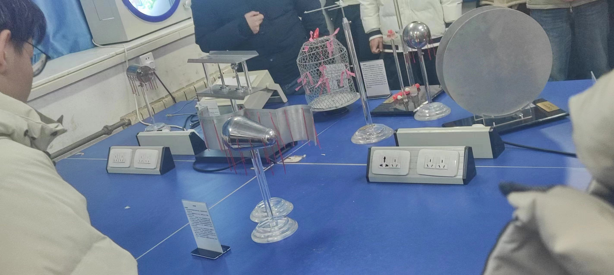

# 观看静电屏蔽演示实验心得体会

在学习和观看静电屏蔽的演示实验后，我对静电屏蔽的原理和应用有了更深入的理解。

静电屏蔽的原理：通过使用导电材料制作屏蔽结构，可以将静电场的影响减小或消除。导电材料能够吸收或分散静电荷，从而保护周围的物体或装置免受静电干扰。

**静电屏蔽**在生活中十分重要，很多场景下都有应用

1. 电子设备：静电屏蔽在电子设备中非常重要。电子设备的内部组件对静电非常敏感，静电放电可能会损坏电子元件或干扰设备的正常运行。静电屏蔽用于减小或消除设备周围的静电场，以保护电子设备的稳定性和可靠性。
2. 医疗设备：在医疗设备中，静电屏蔽可以用于减小静电场的干扰，以确保设备的精确测量和准确操作。例如，在手术室中，静电屏蔽可以防止手术设备受到静电干扰，保护患者的安全。
3. 防静电服装：在一些工作环境中，如电子制造、半导体生产和化学实验室，静电可以引起火灾或爆炸的危险。防静电服装使用导电材料制成，可以将静电荷从人体引导到地面，减少静电的积累和放电。
4. 车辆燃油系统：静电屏蔽在汽车和飞机的燃油系统中起着重要作用。燃油流动时会引起静电的积累，如果不加以控制，可能会导致火灾或爆炸。静电屏蔽可以通过使用导电管道和接地装置，将静电荷从燃油系统中排除，确保安全运行。
5. 包装材料：一些产品，特别是电子产品和易燃物质，需要在包装过程中进行静电屏蔽。这样可以防止静电对产品的损坏或对包装过程的干扰。静电屏蔽材料，如静电屏蔽袋和泡沫，可以用于包装材料，提供静电保护。

总的来说，静电屏蔽的演示实验让我更深入地了解了静电屏蔽的原理和应用。它在保护设备、改善工作环境和确保安全方面发挥着重要作用。我对静电屏蔽的重要性有了更深刻的认识，并意识到它在现实生活中的广泛应用。

# 观看机械共振演示实验的心得体会

在演示实验中，我看到了机械共振的发生。当外部频率与系统的固有频率接近时，物体的振幅明显增大，甚至可能达到很大的幅值。

机械共振是指机械系统所受激励的频率与该系统的某阶固有频率相接近时，系统振幅显著增大的现象。共振时，激励输入机械系统的能量最大，系统出现明显的振型称为位移共振。此外还有在不同频率下发生的速度共振和加速度共振。

机械共振在生活也有很多应用

1. 建筑与桥梁工程：在建筑和桥梁设计中，了解和控制共振现象至关重要。结构的自然频率必须与可能的外部激励频率区分开来，以避免共振造成的振动加剧和破坏。
2. 乐器制造：乐器的共鸣是基于机械共振的原理。例如，弦乐器如吉他、小提琴和钢琴，以及管乐器如长笛和萨克斯管，都利用共振现象产生富有音色的声音。
3. 汽车与航空工程：在汽车和航空工程中，共振的理解对于避免结构疲劳和振动问题非常重要。设计师必须考虑车辆或飞机的固有频率和外部激励频率之间的差异，以确保安全和性能。
4. 振动控制与减震技术：共振现象也可以应用于振动控制领域。例如，在建筑和机械设备中使用减震器、阻尼器和隔振技术来减小振动幅度并吸收能量。
5. 音响系统：音响系统的设计和调校需要考虑共振的影响。合理的箱体设计和低频驱动器的选择可以避免共振引起的失真，并提供更好的音质和音场效果。
6. 精密仪器与设备：在精密仪器和设备中，共振现象可能对其性能和精度产生负面影响。因此，在设计和运行这些设备时，需要特别注意共振现象，并采取措施来避免或抑制共振。

通过机械共振的实验，我对共振现象的原理、重要性和应用有了更深入的理解。这个实验让我更加意识到了共振的潜在风险，并强调了在工程和设计中必须考虑共振现象的重要性。

