# 19-20，模拟卷1，模拟卷2的体型归纳整理

> 19-20标记为真 , 模拟卷1，模拟卷2标记为1,2 
>
> 题目分布标记为xx-x，表示为第xx题，第x小问

## 一、二、选择，填空(21分,21分)

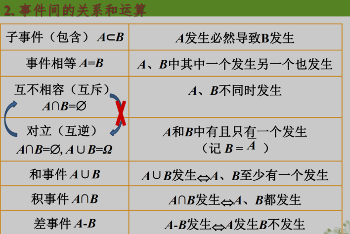

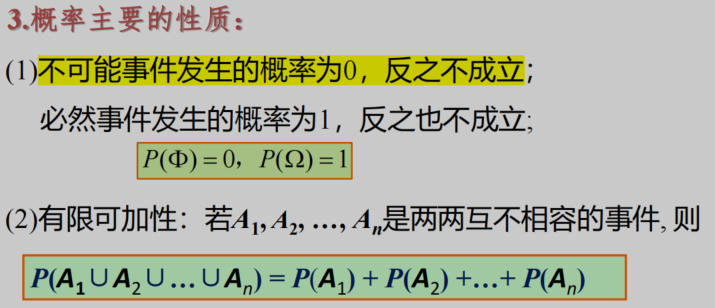

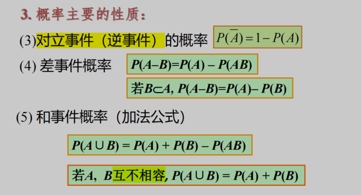

**单选题最后一题:置信区间**

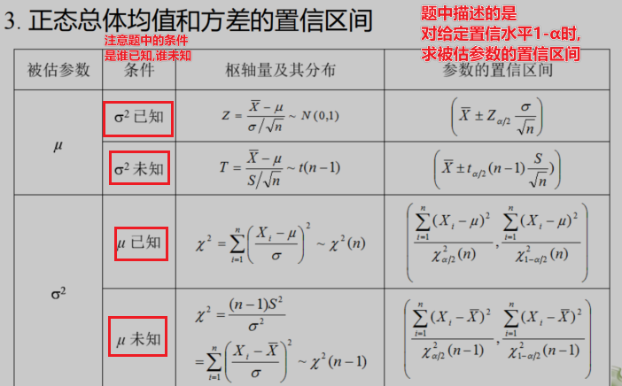

填空题有可能考似然函数

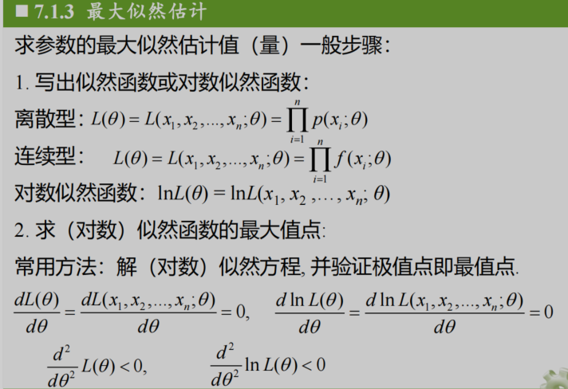

## 三、解答题

> 15-20

### 15.(8分)

必考全概率公式，贝叶斯公式，条件概率的乘法公式
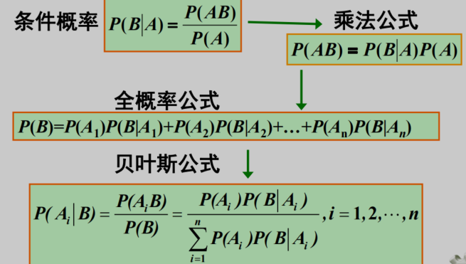

### 16.(8分)

连续型随机变量的性质，分布函数，概率密度(真,16-1)，二项分布(真,16-2)，离散型随机变量分布律的性质(真,16-2)，正态分布

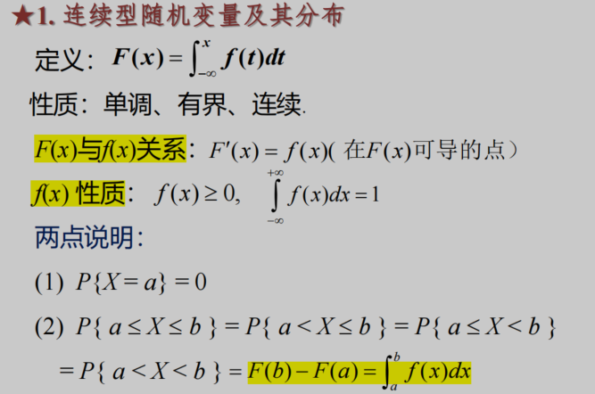

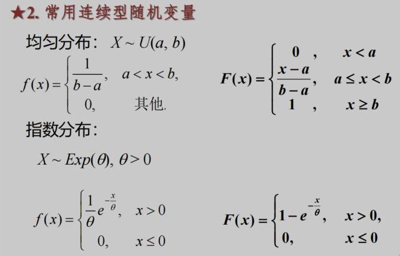

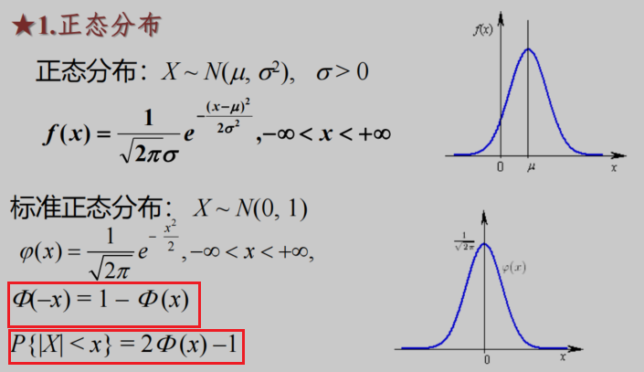

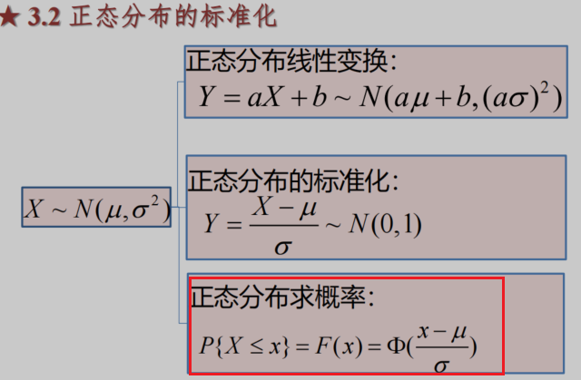

### 17.(8分)

二维离散型随机变量的联合概率密度性质[1]，二维连续型随机变量的联合概率密度性质[2]，求二维连续性随机变量的边缘概率密度[3]，边缘分布率[3](真,17-1)，是否相互独立[5](真,17-2)，最大值与最小值分布[6](真,17-3)

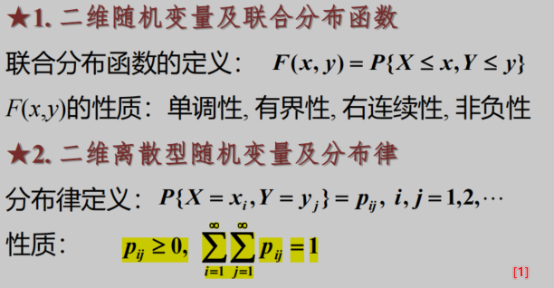

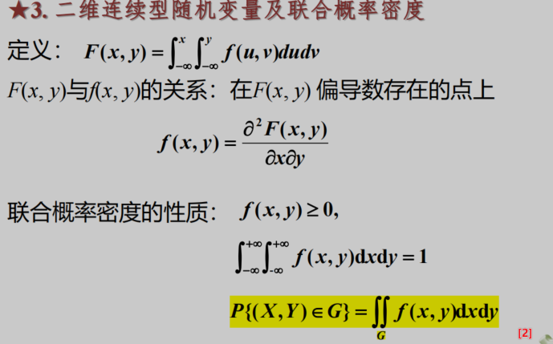

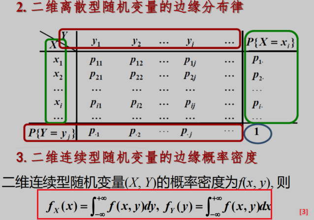

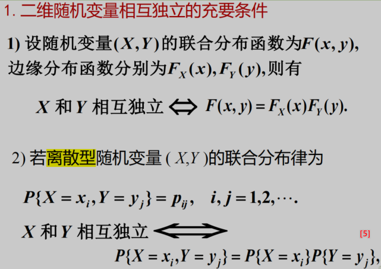

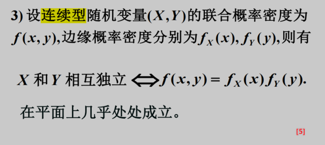

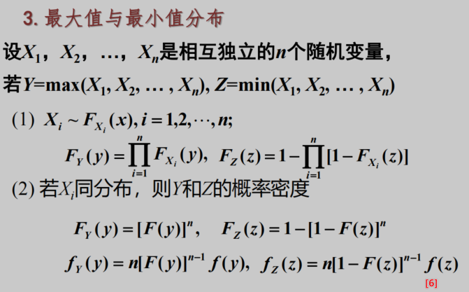

### 18.(7分)

随机变量的数学期望，方差，及其性质[1]，协方差及其相关系数[2]。

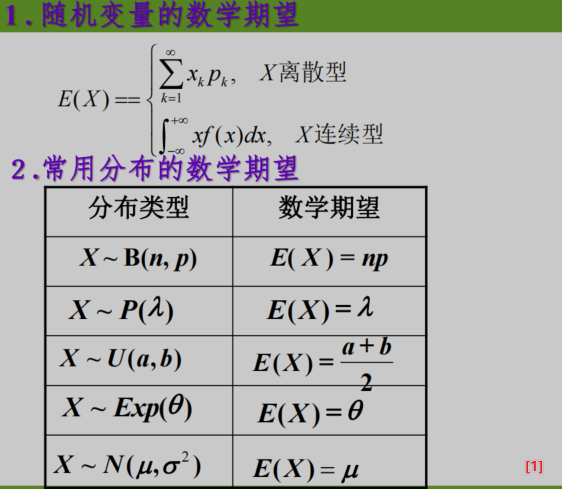

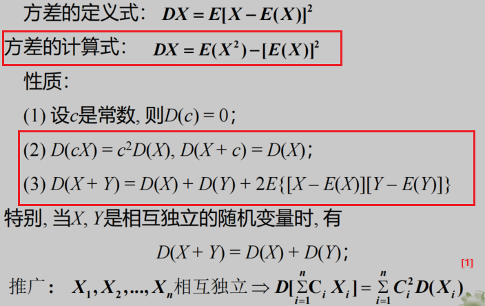

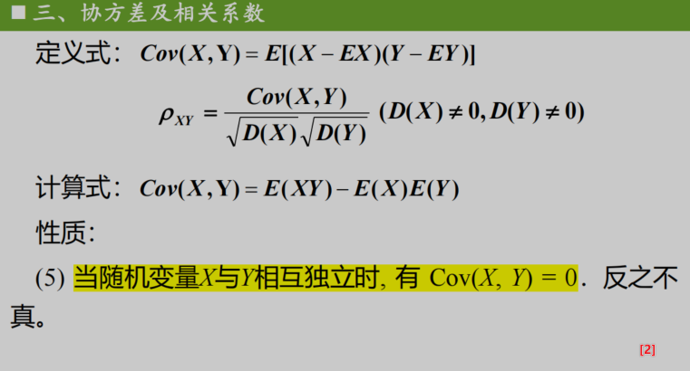

### 19.(8分)

独立同分布的中心极限定理(真,19-1)以及一些分布的组合应用

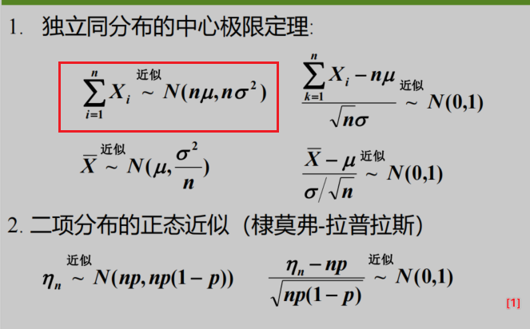

### 20(10分)

求参数的矩估计量，并判断是否是无偏估计量(真,20-1)
①根据题目条件求出数学期望-> 连续型，离散型，化简得到以参数的表示形式
②将参数带入到E(x)中x=参数，化简得到的估计量=①求出的估计量，说明是无偏估计量
③求矩估计值是将样本观测值的数学期望，带入参数的矩估计量中，得到矩估计值[1],(真,20-2)

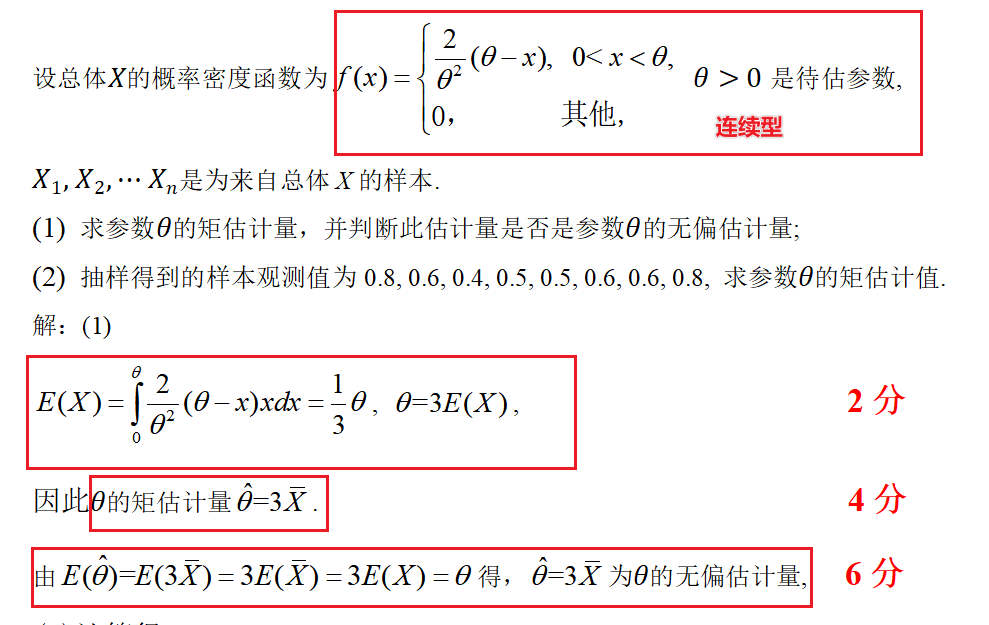

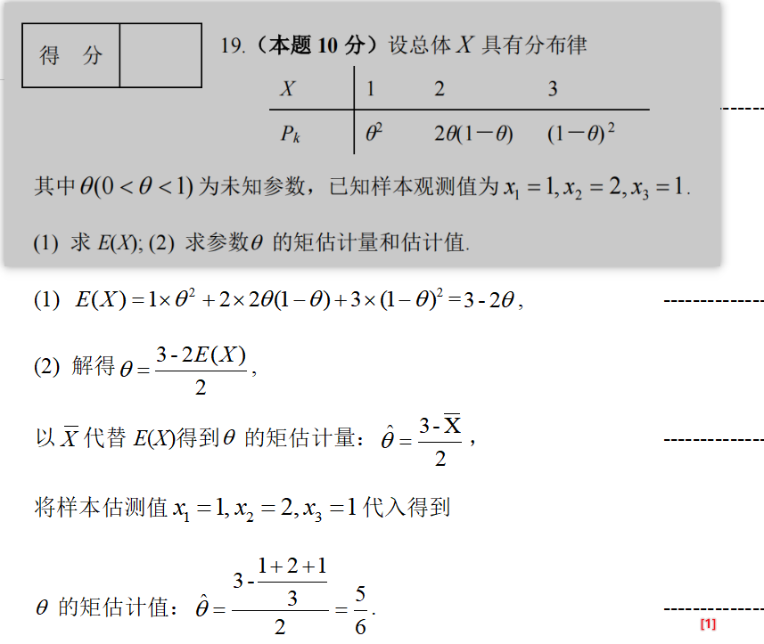

### 21(9分)

**均值为μ的假设检验**

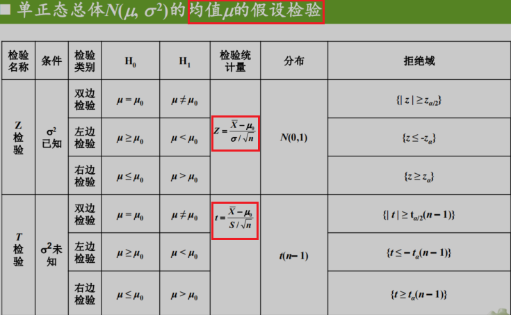

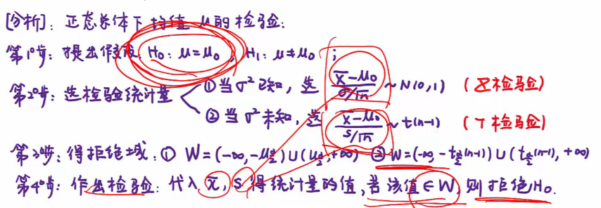

**方差的假设检验**

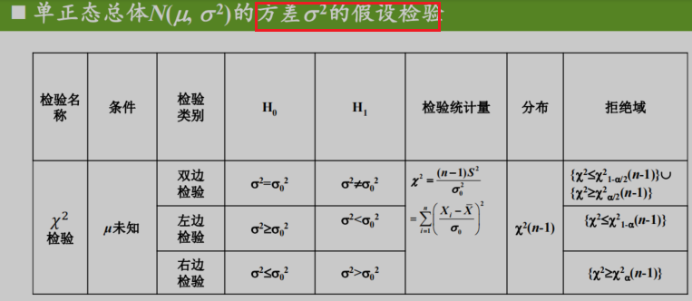

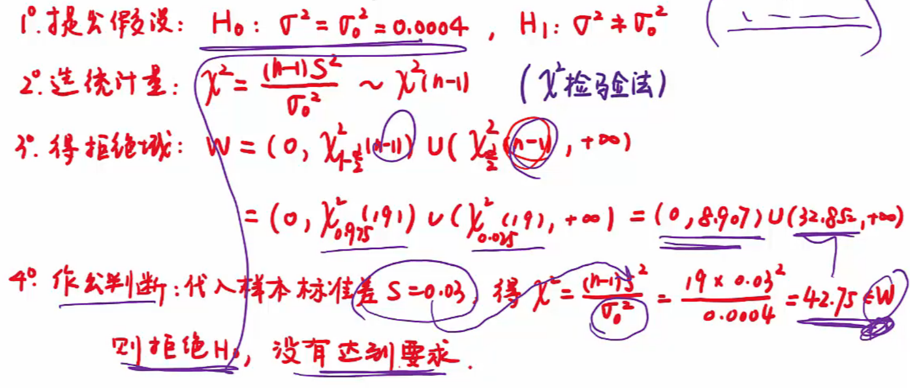
