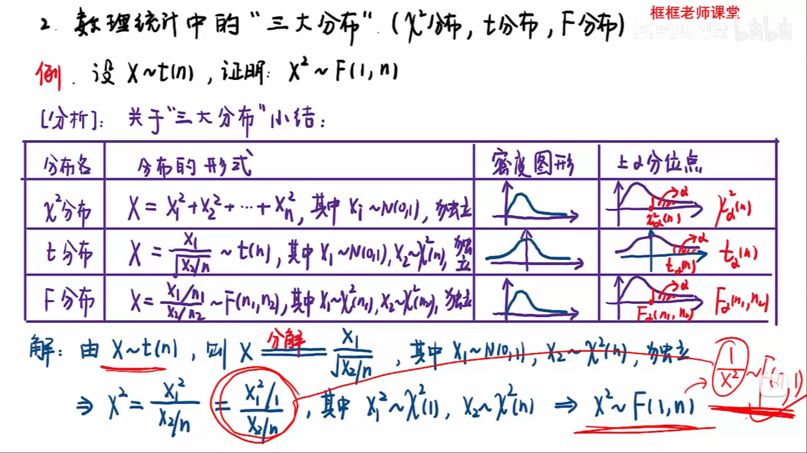

# 框框老师的小课堂

## 第二章:一维机变量的及其分布

### 1.利用常见连续型分布的计算

### 2.连续型变量X的函数的分布

## 第三章:二维离散型随机变量的分布

### 1.二维离散型随机变量的分布

### 2.二维连续型随机变量的相关计算

## 第四章:随机变量的数字特征

### 1.常见分布的数学特征

> 注意：指数分布，在教材上是Exp(x) = 1/β e^-x/β; 此时β 和 λ 互为倒数, 期望与方差互为倒数->🧐老师说就按书本上的来。即期望E(X)=β，方差D(X)=β^2;

### 2.离散型随机变量的协方差、相关系数

### 3.连续型随机变量的协方差、相关系数

### 4.利用切比雪夫不等式估计概率

## 第五章第六章:中心极限定理和数理统计的概念

### 1.利用中心极限定理求概率

### 2.数理统计中的"三大分布"(x^2,t,F)

## 第七章:参数估计

### 1.未知参数的矩估计法与最大似然估计法

### 2.估计量的无偏性与有效性

### 3.未知参数的区间估计

## 第九章:假设检验

### 1.正态总体下均值μ的假设检验(U检验、T检验)

### 2.正态总体下方差的检验(X^2检验)

